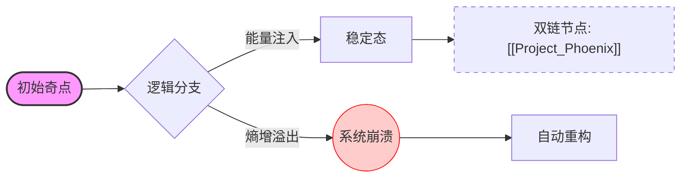

# 🌌 最终测试：超弦虚空接口

## 1. 基础排版与装饰 (Native Basics)

在 **Alpha-Phase** 协议中，所有的 *中微子* 必须经过 ~~逻辑坍缩~~ **双重冗余校验**。
此处测试行内代码：使用 `init --force-quantum` 来重置环境。

* **系统状态：** `Operational`
* **版本哈希：** `0xDEADBEEF...`
* **外部引用：** [点击访问虚空网关 (Rickroll Link)](https://www.youtube.com/watch?v=dQw4w9WgXcQ)

<iframe width="560" height="315" src="https://www.youtube.com/embed/dQw4w9WgXcQ?si=test" title="YouTube video player" frameborder="0" allow="accelerometer; autoplay; clipboard-write; encrypted-media; gyroscope; picture-in-picture; web-share" allowfullscreen></iframe>

点击查看关于虚空的定义[^2]。

<style>
  :root {
    --gd-bg: #ffffff;
    --gd-card-bg: #f9f9f9;
    --gd-border: #e2e8f0;
    --gd-text: #1a202c;
  }

  @media (prefers-color-scheme: dark) {
    :root {
      --gd-bg: #1a1a1a;
      --gd-card-bg: #2d2d2d;
      --gd-border: #404040;
      --gd-text: #f7fafc;
    }
  }

  .guadao-container {
    display: flex;
    gap: 16px;
    background: var(--gd-bg);
    padding: 24px;
    border-radius: 12px;
    color: var(--gd-text);
    transition: all 0.3s ease;
  }

  .guadao-column {
    flex: 1;
    border: 1px solid var(--gd-border);
    background: var(--gd-card-bg);
    padding: 20px;
    border-radius: 8px;
    text-align: center;
    box-shadow: 0 4px 6px -1px rgba(0, 0, 0, 0.1);
  }
</style>

<div class="guadao-container">
  <div class="guadao-column">
    <strong>话题池 (Topic Pool)</strong>
    <p style="font-size: 0.8em; opacity: 0.7;">收纳零散灵感与投稿</p>
  </div>
  <div class="guadao-column">
    <strong>活跃提案 (Proposals)</strong>
    <p style="font-size: 0.8em; opacity: 0.7;">正在竞标或投票中</p>
  </div>
</div>

---

## 2. 逻辑架构图 (Mermaid.js Support)

> **注意：** 渲染此部分需要前端集成 `mermaid.js`。
> 

---

## 3. 双向链接与知识网络 (Wiki-links)

这是一个模拟双链语法的测试，常用于知识库管理：

* 参考文档：[[1]] (模拟链接到 Proposal #1)
* 相关实验：[[Topic:Governance]] (模拟链接到治理话题)
* 核心实体：[[2#overview]] (模拟链接到 Proposal #2 的锚点)

---

## 4. 任务进度与多维列表 (Task Lists & Nesting)

* [x] **任务 A：** 捕获虚数空间中的 $\aleph_0$ 级波动。
* [x] **任务 B：** 修复 `bytes32` 容器溢出。
* [ ] **任务 C：** 执行维度跨越。
    1. 调整 [[Warp_Drive]] 参数。
    2. 校准相位平衡：
        * 子项 2.1: 检查 $\Omega$ 标量。
        * 子项 2.2: 释放多余热能。
    3. 确认无误后按下 <kbd>Enter</kbd>。

---

## 5. 多维数据矩阵 (Table Alignment)

| **节点 ID** | **坐标系 (X/Y)** | **稳定性 (Entropy)** | **实时负载** |
| :--- | :---: | :--- | ---: |
| NODE-01 | `(1.2, 3.4)` | 🟢 **Stable** | 12.5% |
| NODE-42 | `(0, 0)` | 🟡 *Warning* | 89.9% |
| NODE-Σ | `NaN` | 🔴 Critical | **999%** |

---

## 6. 核心数学推导 (LaTeX Equations)

在该模型的非线性演化过程中，我们需要求解 **“广义随机偏移偏微分方程”**：

$$
\frac{\partial \Psi}{\partial t} = \int_{-\infty}^{+\infty} \frac{\xi^{k} + \gamma}{1 + e^{-\beta x}} dx + \sum_{i=1}^{n} \sqrt{\frac{\Delta A_i}{2\pi}}
$$

当 $x \to \infty$ 时，系统趋于行内平衡态 $E = mc^2 + \epsilon$。

---

* **引用测试：**
> “在虚空之中，唯一的真理是 `[[Link_Missing]]`。如果你能看到这行字，说明 Markdown 渲染器工作正常。” —— *虚空观察者* [^1]

---

## 7. 源代码实验室 (Code Highlighting)

### Solidity (用于 DApp 逻辑测试)

```solidity
function voteWithSponsor(uint256 id, uint256 amount) public {
    require(gua.balanceOf(msg.sender) > 0, "No GUA");
    uint256 weight = Math.sqrt(amount); // 测试二次方权重
    // 🌌 虚空注入逻辑
    proposals[id].score += (1 + weight);
}
```

### Python (用于数据处理测试)

```python
def calculate_entropy(data):
    import math
    # 熵增计算
    return sum([p * math.log2(1/p) for p in data if p > 0])
```

---

## 8. 扩展交互组件 (Advanced UI)

<details>
<summary><b>🛠 点击展开高级开发者工具 (Details Tag)</b></summary>

> **警告：** 修改以下参数可能导致 `bytes32` 引用错位。
> * `FLUX_CAPACITOR = 1.21GW`
> * `RETRY_POLICY = exponential_backoff`

</details>

---

## 9. 媒体占位符 (Media/Image)

使用了在线占位符图像进行测试：


---


[^1]: 来源：2026 年第 4 次虚拟会议纪要。
[^2]: 这是一个**复杂的脚注**：
    1. 包含列表。
    2. 包含[链接](https://example.com)。
    3. 甚至是代码：`void_check()`。